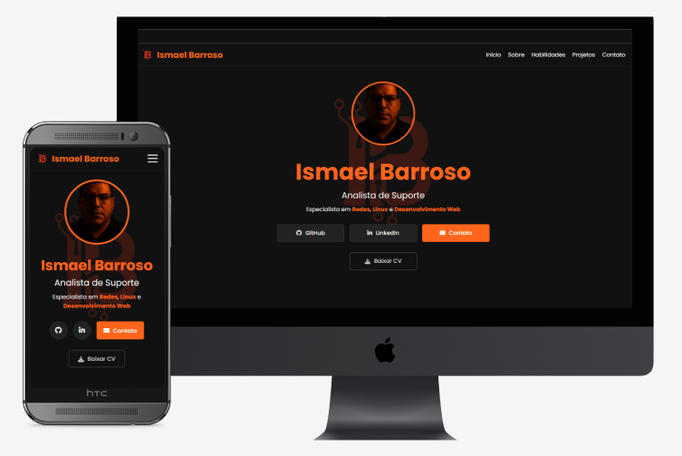

# Portfólio Pessoal - Ismael Barroso

Este é o repositório do meu portfólio pessoal, um site de página única (Single Page Application) desenvolvido para apresentar minhas habilidades, experiência profissional e projetos na área de tecnologia.



---

## Sobre o Projeto

O objetivo deste projeto foi criar um portfólio moderno e totalmente responsivo a partir de um design pré-definido. O desenvolvimento foi focado em utilizar tecnologias web fundamentais (HTML5, CSS3 e JavaScript puro) para construir uma base sólida, interativa e de fácil manutenção.

O site foi construído progressivamente, com foco em aplicar e aprender conceitos importantes de desenvolvimento web.

---

## Tecnologias Utilizadas

A base tecnológica do projeto foi mantida simples e focada nos fundamentos:

- **HTML5:** Para a estrutura semântica do conteúdo.
- **CSS3:** Para toda a estilização, utilizando conceitos modernos como Flexbox, CSS Grid e Media Queries para a responsividade.
- **JavaScript (ES6+):** Para a interatividade do usuário, como o menu de navegação móvel, animações e o comportamento dinâmico de elementos.

---

## Funcionalidades

- **Design Responsivo:** O layout se adapta perfeitamente a desktops, tablets e celulares.
- **Navegação Suave:** A transição entre as seções é feita de forma fluida.
- **Menu Mobile Inteligente:** O menu hambúrguer possui animação de transformação para "X" e se fecha automaticamente ao selecionar uma seção.
- **Linha do Tempo Profissional:** Uma apresentação visual da minha experiência de trabalho.
- **Botão "Voltar ao Topo":** Aparece dinamicamente após a rolagem da página para facilitar a navegação.
- **Download de Currículo:** Link direto para download do meu CV em formato PDF.

---

## Como Executar Localmente

Este projeto não requer nenhuma dependência ou processo de compilação. Para executá-lo localmente, siga os passos:

1.  Clone este repositório para a sua máquina local:
    ```bash
    git clone https://github.com/IsmaelSidney/ismael-barroso-portifolio.git
    ```
2.  Navegue até a pasta do projeto.
3.  Abra o arquivo `index.html` diretamente no seu navegador de preferência (Google Chrome, Firefox, etc.).

---

Este projeto foi desenvolvido por **Ismael Barroso**.
